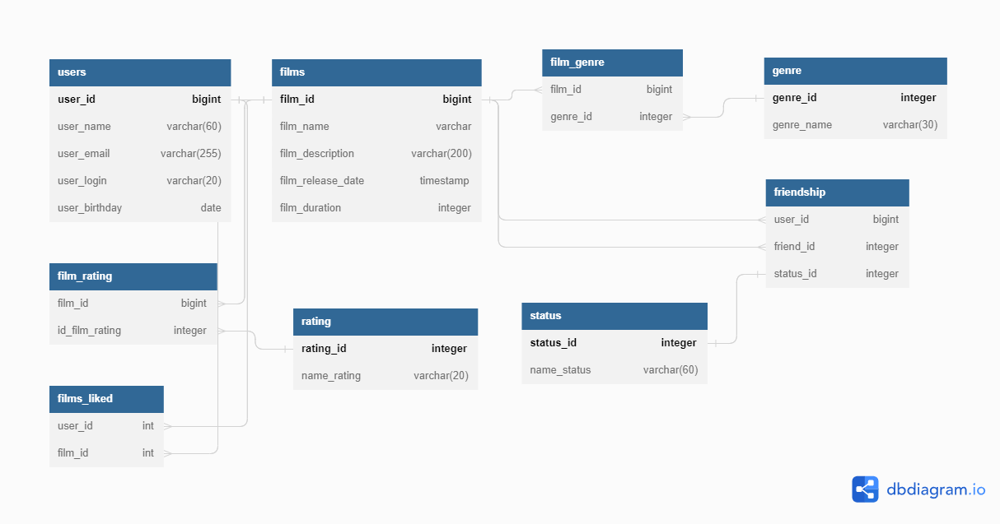

# java-filmorate
Template repository for Filmorate project.

**Промежуточное задание месяца SQL**

[Ссылка на схему БД](https://dbdiagram.io/d/645be7d0dca9fb07c4dc25a8)

<details>
<summary>Код БД</summary>

```sql
drop table if exists FILMS_LIKED cascade;

drop table if exists FILM_GENRE cascade;

drop table if exists FILM_RATING cascade;

drop table if exists FILMS cascade;

drop table if exists FRIENDSHIP cascade;

drop table if exists GENRE cascade;

drop table if exists RATING cascade;

drop table if exists STATUS cascade;

drop table if exists USERS cascade;


CREATE TABLE IF NOT EXISTS users (
                                     user_id bigint GENERATED BY DEFAULT AS IDENTITY PRIMARY KEY,
                                     user_name varchar(60),
    user_email varchar(255) UNIQUE,
    user_login varchar(20),
    user_birthday date
    );

CREATE TABLE IF NOT EXISTS films(
                                    film_id bigint GENERATED BY DEFAULT AS IDENTITY PRIMARY KEY,
                                    film_name varchar,
                                    film_description varchar(200),
    film_release_date timestamp,
    film_duration integer
    );

CREATE TABLE IF NOT EXISTS film_genre (
                                          film_id bigint ,
                                          genre_id integer
);

CREATE TABLE IF NOT EXISTS genre (
                                     genre_id integer GENERATED BY DEFAULT AS IDENTITY PRIMARY KEY ,
                                     genre_name varchar(30)
    );

CREATE TABLE IF NOT EXISTS film_rating (
                                           film_id bigint GENERATED BY DEFAULT AS IDENTITY ,
                                           id_film_rating integer
);

CREATE TABLE IF NOT EXISTS rating (
                                      rating_id integer GENERATED BY DEFAULT AS IDENTITY PRIMARY KEY,
                                      name_rating varchar(20)
    );

CREATE TABLE IF NOT EXISTS status (
                                      status_id integer PRIMARY KEY,
                                      name_status varchar(60)
    );

CREATE TABLE IF NOT EXISTS friendship (
                                          user_id bigint,
                                          friend_id integer,
                                          status_id integer
);

CREATE TABLE IF NOT EXISTS  films_liked (
    user_id int NOT NULL REFERENCES users(user_id) ON delete CASCADE,
    film_id int NOT NULL REFERENCES films(film_id) ON delete CASCADE
    );

ALTER TABLE film_genre ADD FOREIGN KEY (film_id) REFERENCES films (film_id);

ALTER TABLE film_genre ADD FOREIGN KEY (genre_id) REFERENCES genre (genre_id);

ALTER TABLE film_rating ADD FOREIGN KEY (film_id) REFERENCES films (film_id);

ALTER TABLE film_rating ADD FOREIGN KEY (id_film_rating) REFERENCES rating (rating_id);

ALTER TABLE friendship ADD FOREIGN KEY (user_id) REFERENCES users (user_id);

ALTER TABLE friendship ADD FOREIGN KEY (friend_id) REFERENCES users (user_id);
ALTER TABLE friendship ADD FOREIGN KEY (status_id) REFERENCES STATUS (status_id);


```

</details>
<picture>
  <source media="(prefers-color-scheme: dark)" srcset="Schema.png">
  <source media="(prefers-color-scheme: light)" srcset="Schema.png">
  
</picture>
